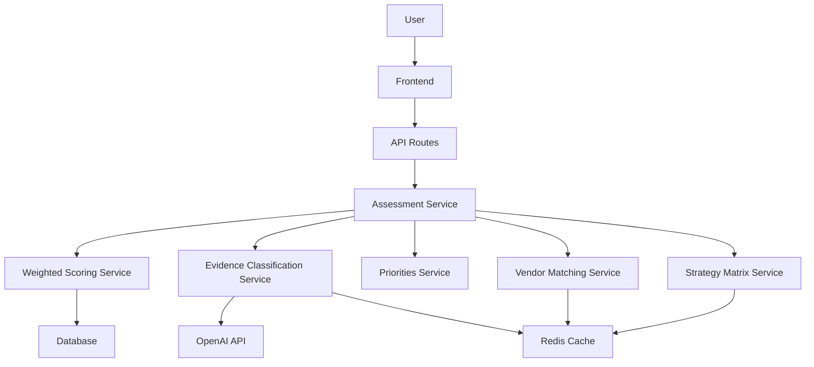

# Story 1.25: Documentation and Training Materials

## Status
Draft

## Story

**As a** technical writer / product owner,
**I want** to create comprehensive documentation and training materials for enhanced assessment features,
**so that** users, admins, and support staff understand the new methodology and can use features effectively.

## Acceptance Criteria

1. **User Guide: Enhanced Risk Assessment** (`docs/user-guide-enhanced-assessment.md`)
   - Overview of enhanced methodology (evidence tiers, weighted scoring, regulatory alignment)
   - Step-by-step walkthrough: Create assessment → Upload documents → Review classifications → Complete assessment → Review results
   - Screenshots of each major UI component
   - Best practices: "How to get the best risk score" (upload Tier 2 evidence, address foundational gaps)
   - FAQ section (10+ common questions)
2. **User Guide: Priorities Questionnaire** (`docs/user-guide-priorities-questionnaire.md`)
   - Purpose: Personalized vendor matching
   - Step-by-step walkthrough of 6-step questionnaire
   - Tips for each step (e.g., "How to determine your top 3 priorities")
   - How priorities affect vendor recommendations
3. **User Guide: Strategy Matrix** (`docs/user-guide-strategy-matrix.md`)
   - Understanding timeline buckets (immediate/near-term/strategic)
   - How to use the roadmap for budgeting and planning
   - Exporting and sharing strategy matrix
4. **Admin Guide: Weight Management** (`docs/admin-guide-weight-management.md`)
   - When and why to adjust weights
   - Regulatory framework alignment principles
   - Step-by-step: Review current weights → Make adjustments → Provide rationale → Save changes
   - Preview impact feature explanation
   - Best practices: "Don't adjust weights without regulatory justification"
5. **Admin Guide: Evidence Classification Review** (`docs/admin-guide-evidence-classification-review.md`)
   - Understanding confidence scores
   - When to override AI classifications
   - Step-by-step: Review low-confidence documents → Preview document → Override if needed → Provide justification
   - Classification criteria reference (Tier 0/1/2 definitions with examples)
6. **Developer Documentation: API Reference** (`docs/api-reference-enhanced-assessment.md`)
   - All new endpoints documented:
     - POST/GET/PUT /assessments/:id/priorities
     - GET /assessments/:id/vendor-matches-v2
     - GET /assessments/:id/strategy-matrix
     - POST /documents/:id/reclassify
     - GET /admin/evidence-classification/review
     - PUT /admin/templates/:id/weights
   - Request/response schemas with examples
   - Authentication requirements
   - Rate limiting details
   - Error codes and handling
7. **Developer Documentation: Architecture Overview** (`docs/architecture-enhanced-assessment.md`)
   - High-level architecture diagram showing new services and data flow
   - Service descriptions:
     - evidence-classification.service.ts
     - weighted-scoring.service.ts
     - vendor-matching.service.ts
     - priorities.service.ts
     - strategy-matrix.service.ts
   - Database schema changes explained
   - Caching strategy
   - Feature flag implementation
8. **Support Guide: Troubleshooting** (`docs/support-guide-enhanced-assessment.md`)
   - Common issues and resolutions:
     - "User can't see enhanced features" → Check feature flag, check subscription tier
     - "Evidence classification stuck" → Check background job queue, retry classification
     - "Vendor matches show no results" → Check priorities submitted, check vendor database
     - "Old assessments don't have scores" → Explain scoring was implemented on specific date, recommend re-running assessment
   - How to access logs for debugging
   - Escalation procedures
9. **Video Tutorial: Enhanced Assessment Walkthrough** (5-7 minutes)
   - Screen recording with voiceover
   - Demonstrates: Upload documents → See classifications → Complete assessment → Review enhanced results → Submit priorities → View vendor matches and strategy matrix
   - Highlights key features and benefits
   - Published on help center and YouTube
10. **Release Notes: Enhanced Risk Assessment Launch** (`docs/release-notes-enhanced-assessment.md`)
    - Feature overview
    - What's new for users
    - What's new for admins
    - Migration guide: "What happens to my existing assessments?"
    - Known limitations (English only, desktop-optimized, etc.)
    - Feedback and support contact

## Tasks / Subtasks

- [ ] Write User Guide: Enhanced Risk Assessment (AC: 1)
  - [ ] Write overview of enhanced methodology section
  - [ ] Create step-by-step walkthrough with numbered steps
  - [ ] Capture screenshots of UI components (11+ screenshots)
  - [ ] Write best practices section with actionable tips
  - [ ] Write FAQ section with 10+ common questions
  - [ ] Review for clarity and completeness
- [ ] Write User Guide: Priorities Questionnaire (AC: 2)
  - [ ] Write purpose and benefits section
  - [ ] Create step-by-step walkthrough of 6-step questionnaire
  - [ ] Write tips for each step
  - [ ] Explain how priorities affect vendor recommendations
  - [ ] Capture screenshots of each questionnaire step
- [ ] Write User Guide: Strategy Matrix (AC: 3)
  - [ ] Explain timeline buckets and organization logic
  - [ ] Write section on using roadmap for budgeting/planning
  - [ ] Document export and sharing functionality
  - [ ] Capture screenshots of strategy matrix UI
- [ ] Write Admin Guide: Weight Management (AC: 4)
  - [ ] Explain when and why to adjust weights
  - [ ] Write regulatory framework alignment principles
  - [ ] Create step-by-step guide for weight adjustment
  - [ ] Explain preview impact feature
  - [ ] Write best practices and warnings section
  - [ ] Capture screenshots of weight management UI
- [ ] Write Admin Guide: Evidence Classification Review (AC: 5)
  - [ ] Explain confidence scores and what they mean
  - [ ] Write guidance on when to override AI classifications
  - [ ] Create step-by-step override workflow
  - [ ] Write classification criteria reference with examples
  - [ ] Capture screenshots of evidence review UI
- [ ] Write Developer Documentation: API Reference (AC: 6)
  - [ ] Document POST/GET/PUT /assessments/:id/priorities endpoint
  - [ ] Document GET /assessments/:id/vendor-matches-v2 endpoint
  - [ ] Document GET /assessments/:id/strategy-matrix endpoint
  - [ ] Document POST /documents/:id/reclassify endpoint
  - [ ] Document GET /admin/evidence-classification/review endpoint
  - [ ] Document PUT /admin/templates/:id/weights endpoint
  - [ ] Include request/response schemas with JSON examples
  - [ ] Document authentication, rate limiting, error codes
- [ ] Write Developer Documentation: Architecture Overview (AC: 7)
  - [ ] Create high-level architecture diagram (use draw.io or Mermaid)
  - [ ] Write service descriptions for 5 new services
  - [ ] Document database schema changes (list tables, fields)
  - [ ] Explain caching strategy with Redis key patterns
  - [ ] Explain feature flag implementation and rollout
- [ ] Write Support Guide: Troubleshooting (AC: 8)
  - [ ] Write troubleshooting entry for feature visibility issues
  - [ ] Write troubleshooting entry for classification issues
  - [ ] Write troubleshooting entry for vendor matching issues
  - [ ] Write troubleshooting entry for legacy assessment questions
  - [ ] Document how to access logs for debugging
  - [ ] Document escalation procedures
- [ ] Create Video Tutorial: Enhanced Assessment Walkthrough (AC: 9)
  - [ ] Write video script with voiceover narration
  - [ ] Record screen walkthrough of full assessment flow
  - [ ] Record voiceover audio
  - [ ] Edit video with annotations and highlights
  - [ ] Export video in 1080p MP4 format
  - [ ] Upload to help center and YouTube
  - [ ] Add video embed to user guides
- [ ] Write Release Notes: Enhanced Risk Assessment Launch (AC: 10)
  - [ ] Write feature overview section
  - [ ] Write "What's new for users" section
  - [ ] Write "What's new for admins" section
  - [ ] Write migration guide for existing assessments
  - [ ] Document known limitations
  - [ ] Include feedback and support contact information

## Dev Notes

### Relevant Source Tree
- `docs/user-guide-enhanced-assessment.md` - New user guide (create)
- `docs/user-guide-priorities-questionnaire.md` - New user guide (create)
- `docs/user-guide-strategy-matrix.md` - New user guide (create)
- `docs/admin-guide-weight-management.md` - New admin guide (create)
- `docs/admin-guide-evidence-classification-review.md` - New admin guide (create)
- `docs/api-reference-enhanced-assessment.md` - New API reference (create)
- `docs/architecture-enhanced-assessment.md` - New architecture doc (create)
- `docs/support-guide-enhanced-assessment.md` - New support guide (create)
- `docs/release-notes-enhanced-assessment.md` - New release notes (create)
- `docs/prd.md` - Existing PRD (reference for content)
- `docs/architecture.md` - Existing architecture doc (reference for technical details)

### Documentation Standards

**Writing Style:**
- Clear, concise, action-oriented language
- Use second person ("you") for user-facing docs
- Use active voice ("Click the button" not "The button is clicked")
- Define technical terms on first use
- Break complex procedures into numbered steps
- Include examples and screenshots liberally

**Document Structure:**
All documentation follows consistent structure:
1. Title (H1)
2. Table of Contents (for docs >1000 words)
3. Overview / Introduction
4. Main content sections (H2)
5. Subsections (H3)
6. Examples, screenshots, code blocks
7. FAQ or Troubleshooting (if applicable)
8. Related Resources / Next Steps

**Markdown Formatting:**
- Use proper heading hierarchy (H1 → H2 → H3)
- Use code blocks with language syntax highlighting
- Use tables for structured data (API parameters, error codes)
- Use blockquotes for important notes/warnings
- Use numbered lists for sequential steps
- Use bullet lists for non-sequential items

**Screenshot Guidelines:**
- Capture at 1920x1080 resolution (standard desktop)
- Include browser chrome for context
- Highlight important UI elements with red boxes or arrows
- Crop to relevant area (don't show entire desktop)
- Save as PNG with descriptive filename: `screenshot-evidence-tier-badge.png`
- Store in `docs/images/` directory

**Code Examples:**
- Include complete, runnable examples
- Use realistic data (not foo/bar)
- Include error handling
- Add comments explaining non-obvious logic
- Use consistent formatting (Prettier)

### API Documentation Format

**Endpoint Documentation Template:**
```markdown
### POST /api/assessments/:id/priorities

**Description:** Submit priorities questionnaire for personalized vendor matching.

**Authentication:** Required (JWT Bearer token)

**URL Parameters:**
- `id` (string, required) - Assessment ID

**Request Body:**
```json
{
  "selectedUseCases": ["CUSTOMER_DUE_DILIGENCE", "TRANSACTION_MONITORING"],
  "rankedPriorities": ["CUSTOMER_DUE_DILIGENCE"],
  "budgetRange": "RANGE_50K_100K",
  "deploymentPreference": "CLOUD_HOSTED",
  "speedImportance": 4,
  "additionalContext": "Optional text"
}
```

**Response (201 Created):**
```json
{
  "success": true,
  "data": {
    "id": "priorities_123",
    "assessmentId": "asmt_456",
    "selectedUseCases": ["CUSTOMER_DUE_DILIGENCE", "TRANSACTION_MONITORING"],
    "createdAt": "2025-10-07T12:00:00Z"
  }
}
```

**Error Responses:**
- `400 Bad Request` - Invalid data (rankedPriorities not subset of selectedUseCases)
- `401 Unauthorized` - Missing or invalid JWT token
- `404 Not Found` - Assessment not found
- `428 Precondition Required` - Assessment methodology is "unavailable"

**Rate Limiting:** 10 requests per minute per user
```

### Architecture Diagram

**Diagram Tool:** Use Mermaid.js for text-based diagrams (renders in Markdown):



Alternatively, use draw.io and export as PNG/SVG for more detailed diagrams.

### Video Production

**Video Tutorial Requirements:**
- **Length:** 5-7 minutes (not too long, attention span)
- **Resolution:** 1080p (1920x1080)
- **Format:** MP4 with H.264 codec
- **Audio:** Clear voiceover, no background music (accessibility)
- **Captions:** Include English captions (accessibility)

**Video Structure:**
1. Introduction (30 seconds) - What viewers will learn
2. Document Upload (60 seconds) - Show upload and classification
3. Evidence Tiers (60 seconds) - Explain tier badges and distribution
4. Complete Assessment (60 seconds) - Show completion and scoring
5. Enhanced Results (90 seconds) - Walkthrough of weighted scoring breakdown
6. Priorities Questionnaire (90 seconds) - Complete 6-step questionnaire
7. Vendor Matches (60 seconds) - Show vendor recommendations
8. Strategy Matrix (60 seconds) - Explain timeline buckets
9. Conclusion (30 seconds) - Recap benefits and next steps

**Screen Recording Tools:**
- OBS Studio (free, open source)
- Loom (simple, cloud-based)
- Camtasia (professional editing features)

**Voiceover Recording:**
- Use USB microphone for clear audio
- Record in quiet environment
- Speak slowly and clearly
- Pause between sections for editing

### Integration Points

**Cross-References:**
Documentation should link to related documents:
- User guides link to API reference for developers
- Admin guides link to architecture doc for technical details
- Support guide links to user guides for self-service
- Release notes link to all guides

**Help Center Integration:**
All documentation published to in-app help center:
- User guides accessible via "?" icon in UI
- Context-sensitive help links to relevant guide sections
- Search functionality for finding help articles

**In-App Help Links:**
Update frontend components to link to documentation:
- Evidence tier badge → User guide section on tiers
- Priorities questionnaire → Priorities questionnaire guide
- Strategy matrix → Strategy matrix guide
- Admin weight management → Weight management guide

### Testing

**Documentation Review Process:**
1. **Technical Review** - Developer verifies all code examples work, all API schemas accurate
2. **Editorial Review** - Technical writer reviews for clarity, grammar, consistency
3. **User Testing** - 3-5 beta users follow guides, report unclear sections
4. **Screenshot Verification** - Verify all screenshots match current UI (before launch)
5. **Link Checking** - Verify all internal/external links work

**Documentation Quality Checklist:**
- [ ] All code examples tested and work
- [ ] All screenshots current and clear
- [ ] All steps in procedures tested end-to-end
- [ ] No broken links
- [ ] No spelling/grammar errors
- [ ] Consistent terminology throughout
- [ ] Proper heading hierarchy
- [ ] Table of contents (for long docs)
- [ ] Related resources section
- [ ] Feedback mechanism (email or form)

**Acceptance Testing:**
- Non-technical user can follow user guides and complete tasks
- Support team can use troubleshooting guide to resolve common issues
- Developer can use API reference to integrate with API
- Admin can use admin guides to configure system

**Coverage Target:**
- All 8 new API endpoints documented
- All 5 new services explained in architecture doc
- All 4+ common support issues covered in troubleshooting guide
- All major UI components shown in screenshots (15+ screenshots)

**Location:** No automated tests for documentation, but manual review checklists maintained in `docs/review-checklist.md`

**Continuous Maintenance:**
- Update screenshots when UI changes
- Update API examples when endpoints change
- Update troubleshooting guide as new issues discovered
- Update FAQ based on user questions

## Change Log

| Date       | Version | Description                          | Author        |
|------------|---------|--------------------------------------|---------------|
| 2025-10-07 | 1.0     | Initial story created from PRD Epic 1 | SM (Winston)  |

## Dev Agent Record

### Agent Model Used
_To be populated by dev agent during implementation_

### Debug Log References
_To be populated by dev agent during implementation_

### Completion Notes
_To be populated by dev agent during implementation_

### File List
_To be populated by dev agent during implementation_

## QA Results

_To be populated by QA agent after implementation review_
