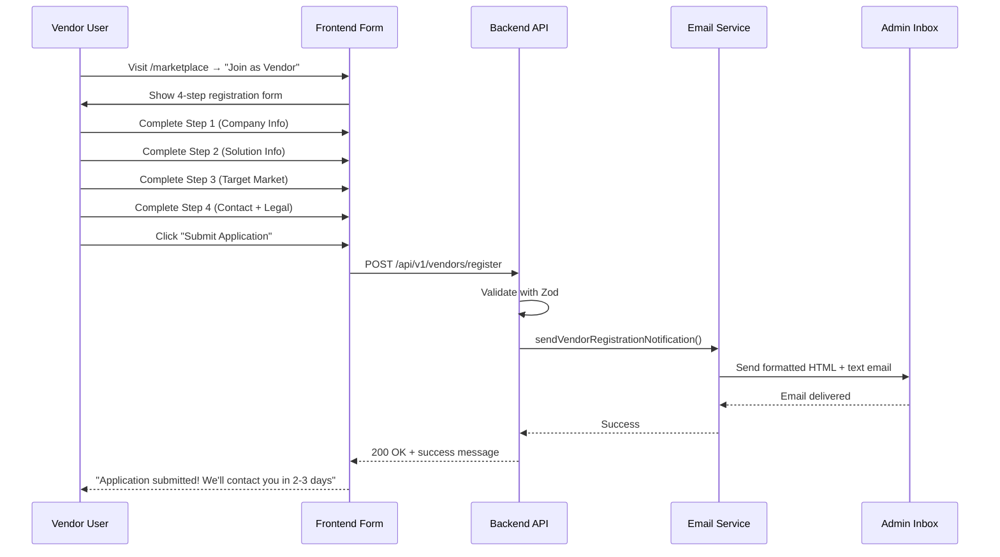

# Vendor Registration Form - Documentation

**Project:** Heliolus Compliance Platform
**Last Updated:** 2025-10-30
**Admin Email:** heliolusadmin@ai-thea.com

---

## Table of Contents

1. [Overview](#overview)
2. [User Flow](#user-flow)
3. [Form Fields](#form-fields)
4. [Backend Processing](#backend-processing)
5. [Email Notification](#email-notification)
6. [Configuration](#configuration)
7. [Testing](#testing)
8. [Troubleshooting](#troubleshooting)

---

## Overview

The Vendor Registration Form allows compliance solution vendors to apply for listing in the Heliolus marketplace. When a vendor submits the form:

1. ✅ **Data is validated** using Zod schema
2. ✅ **Email notification sent** to admin (`heliolusadmin@ai-thea.com`)
3. ✅ **Confirmation shown** to vendor
4. ✅ **Application logged** in backend

**Key Files:**
- **Frontend:** `frontend/src/components/VendorOnboarding.tsx` (635 lines)
- **Backend Route:** `backend/src/routes/vendor.routes.ts` (lines 132-236)
- **Email Service:** `backend/src/services/email.service.ts` (lines 679-866)

---

## User Flow

### Step-by-Step Process



### Form Steps

#### **Step 1: Company Information**
- Company Name *
- Website *
- Company Logo (upload)
- Description *
- Founded Year
- Headquarters
- Employee Count

#### **Step 2: Solution Information**
- Primary Category * (dropdown)
- Pricing Range *
- Implementation Time
- Key Features (multi-add)
- Certifications & Compliance (multi-add)

#### **Step 3: Target Market**
- Client Types (checkboxes)
- Supported Regions (checkboxes)
- Integrations (multi-add)

#### **Step 4: Contact & Legal**
- Primary Contact Name *
- Contact Email *
- Contact Phone
- Case Studies (textarea)
- Terms of Service agreement *
- Privacy Policy agreement *

**\* Required fields**

---

## Form Fields

### Complete Field Specification

| Field Name | Type | Required | Validation | Max Length | Example |
|------------|------|----------|------------|------------|---------|
| `companyName` | String | ✅ | Min 1 char | - | "Acme Compliance Solutions" |
| `website` | String | ✅ | Valid URL | - | "https://acme-compliance.com" |
| `logo` | File | ❌ | PNG/JPG/SVG | - | (Upload widget) |
| `description` | String | ✅ | Min 1 char | - | "Leading AML solutions..." |
| `foundedYear` | String | ❌ | - | - | "2020" |
| `headquarters` | String | ❌ | - | - | "San Francisco, CA" |
| `employeeCount` | String | ❌ | Dropdown | - | "51-200" |
| `category` | String | ✅ | From list | - | "Transaction Monitoring" |
| `pricing` | String | ❌ | - | - | "$500-2000/month" |
| `implementationTime` | String | ❌ | - | - | "2-4 weeks" |
| `features` | Array | ❌ | - | - | ["Real-time alerts", "AI-powered"] |
| `certifications` | Array | ❌ | - | - | ["SOC 2", "ISO 27001"] |
| `clientTypes` | Array | ❌ | - | - | ["Banks", "Fintech Companies"] |
| `supportedRegions` | Array | ❌ | - | - | ["North America", "Europe"] |
| `integrations` | Array | ❌ | - | - | ["Salesforce", "ServiceNow"] |
| `contactName` | String | ✅ | Min 1 char | - | "John Smith" |
| `contactEmail` | String | ✅ | Valid email | - | "john@acme.com" |
| `contactPhone` | String | ❌ | - | - | "+1 (555) 123-4567" |
| `casStudies` | String | ❌ | - | - | "Helped Bank X reduce false positives..." |
| `termsAccepted` | Boolean | ✅ | Must be true | - | true |
| `dataProcessingAccepted` | Boolean | ✅ | Must be true | - | true |

### Category Options

Available in dropdown:
- Customer Due Diligence
- Transaction Monitoring
- Sanctions Screening
- Risk Assessment
- Regulatory Reporting
- All-in-One Solution
- Data Analytics
- Case Management

### Employee Count Options

- 1-10 employees
- 11-50 employees
- 51-200 employees
- 201-1000 employees
- 1000+ employees

### Client Type Options

- Banks
- Credit Unions
- Payment Processors
- Fintech Companies
- Insurance Companies
- Investment Firms
- Cryptocurrency Exchanges
- Money Service Businesses

### Supported Regions Options

- North America
- Europe
- Asia-Pacific
- Latin America
- Middle East
- Africa

---

## Backend Processing

### API Endpoint

**Endpoint:** `POST /api/v1/vendors/register`

**Authentication:** None (public endpoint)

**Request Body:**
```json
{
  "companyName": "Acme Compliance Solutions",
  "website": "https://acme-compliance.com",
  "description": "Leading provider of AI-powered AML solutions",
  "foundedYear": "2020",
  "headquarters": "San Francisco, CA",
  "employeeCount": "51-200",
  "category": "Transaction Monitoring",
  "pricing": "$500-2000/month",
  "implementationTime": "2-4 weeks",
  "features": ["Real-time alerts", "AI-powered analytics"],
  "certifications": ["SOC 2", "ISO 27001"],
  "clientTypes": ["Banks", "Fintech Companies"],
  "supportedRegions": ["North America", "Europe"],
  "integrations": ["Salesforce", "ServiceNow"],
  "contactName": "John Smith",
  "contactEmail": "john@acme.com",
  "contactPhone": "+1 (555) 123-4567",
  "casStudies": "Helped Bank X reduce false positives by 40%"
}
```

**Success Response (200 OK):**
```json
{
  "success": true,
  "message": "Your vendor application has been submitted successfully. We will review it and contact you within 2-3 business days."
}
```

**Error Response (400 Bad Request):**
```json
{
  "message": "Validation failed",
  "code": "VALIDATION_ERROR",
  "statusCode": 400,
  "details": [
    {
      "path": ["companyName"],
      "message": "Company name is required"
    }
  ],
  "timestamp": "2025-10-30T12:00:00.000Z"
}
```

**Error Response (500 Internal Server Error):**
```json
{
  "message": "Failed to submit vendor registration. Please try again later.",
  "code": "REGISTRATION_FAILED",
  "statusCode": 500,
  "timestamp": "2025-10-30T12:00:00.000Z"
}
```

### Validation Rules

**Zod Schema** (`backend/src/routes/vendor.routes.ts:105-124`):

```typescript
const VendorRegistrationRequestSchema = z.object({
  companyName: z.string().min(1, 'Company name is required'),
  website: z.string().url('Valid website URL required'),
  description: z.string().min(1, 'Description is required'),
  foundedYear: z.string().optional(),
  headquarters: z.string().optional(),
  employeeCount: z.string().optional(),
  category: z.string().min(1, 'Category is required'),
  pricing: z.string().optional(),
  implementationTime: z.string().optional(),
  features: z.array(z.string()).default([]),
  certifications: z.array(z.string()).default([]),
  clientTypes: z.array(z.string()).default([]),
  supportedRegions: z.array(z.string()).default([]),
  integrations: z.array(z.string()).default([]),
  contactName: z.string().min(1, 'Contact name is required'),
  contactEmail: z.string().email('Valid contact email required'),
  contactPhone: z.string().optional(),
  casStudies: z.string().optional(),
});
```

### Processing Flow

**Route Handler** (`backend/src/routes/vendor.routes.ts:191-236`):

1. **Receive Request** - Parse JSON body
2. **Validate Data** - Use Zod schema
3. **Get Admin Email** - From `env.ADMIN_EMAIL` (default: `heliolusadmin@ai-thea.com`)
4. **Send Notification** - Call `emailService.sendVendorRegistrationNotification()`
5. **Log Submission** - Log company name and contact email
6. **Return Success** - Send 200 response with message

**Error Handling:**
- Zod validation errors → 400 with detailed error messages
- Email service errors → 500 (but don't expose email failure to user)
- Any other errors → 500 with generic message

---

## Email Notification

### Admin Email Details

**Recipient:** `heliolusadmin@ai-thea.com` (configurable via `ADMIN_EMAIL` env variable)

**Sender:** `Heliolus Platform <noreply@heliolus.com>` (from `POSTMARK_FROM_EMAIL` and `POSTMARK_FROM_NAME`)

**Subject:** `New Vendor Registration: {Company Name}`

**Example:** `New Vendor Registration: Acme Compliance Solutions`

### Email Format

The email service generates **two versions**:

#### 1. HTML Email (Formatted)

**Features:**
- Professional styling with company colors
- Organized sections with headers
- Bullet lists for arrays
- Responsive design
- Clickable email link
- Submission timestamp

**Sections:**
1. **Header** - "New Vendor Registration Application"
2. **Company Information** - Name, website, description, founded, headquarters, employees
3. **Solution Information** - Category, pricing, implementation time, features, certifications
4. **Target Market** - Client types, regions, integrations
5. **Contact Information** - Name, email (clickable), phone
6. **Case Studies** - Full text if provided
7. **Footer** - Submission timestamp

**Styling:**
```css
- Font: Arial, sans-serif
- Primary color: #2563eb (blue)
- Secondary color: #1e40af (dark blue)
- Background: #f9fafb (light gray sections)
- Text: #111827 (dark gray)
- Labels: Bold, #4b5563 (medium gray)
```

#### 2. Plain Text Email (Fallback)

**Format:**
```
New Vendor Registration Application
=====================================

COMPANY INFORMATION
-------------------
Company Name: Acme Compliance Solutions
Website: https://acme-compliance.com
Description: Leading provider of AI-powered AML solutions
Founded: 2020
Headquarters: San Francisco, CA
Employee Count: 51-200

SOLUTION INFORMATION
--------------------
Primary Category: Transaction Monitoring
Pricing: $500-2000/month
Implementation Time: 2-4 weeks
Key Features:
  - Real-time alerts
  - AI-powered analytics
Certifications:
  - SOC 2
  - ISO 27001

TARGET MARKET
-------------
Client Types:
  - Banks
  - Fintech Companies
Supported Regions:
  - North America
  - Europe
Integrations:
  - Salesforce
  - ServiceNow

CONTACT INFORMATION
-------------------
Name: John Smith
Email: john@acme.com
Phone: +1 (555) 123-4567

CASE STUDIES
------------
Helped Bank X reduce false positives by 40%

---
This is an automated notification from the Heliolus vendor registration system.
Submitted on: 10/30/2025, 12:00:00 PM
```

### Email Service Implementation

**Service Method** (`backend/src/services/email.service.ts:679-866`):

```typescript
async sendVendorRegistrationNotification(
  adminEmail: string,
  registrationData: VendorRegistrationData
): Promise<void>
```

**Features:**
- ✅ **Retry Logic** - 3 attempts with exponential backoff (2-5 seconds)
- ✅ **Error Handling** - Logs failures, throws error if all retries fail
- ✅ **Comprehensive Data** - All form fields included in email
- ✅ **Conditional Rendering** - Optional fields only shown if provided
- ✅ **Array Formatting** - Lists converted to bullet points (HTML) or dashes (text)
- ✅ **Timestamp** - Submission date/time automatically added

**Email Provider:** Postmark (via `postmark` npm package)

**Message Stream:** `outbound`

---

## Configuration

### Environment Variables

**Required:**

```bash
# Admin email for vendor registration notifications
ADMIN_EMAIL="heliolusadmin@ai-thea.com"

# Postmark email service
POSTMARK_API_KEY="your-postmark-api-key-here"
POSTMARK_FROM_EMAIL="noreply@heliolus.com"
POSTMARK_FROM_NAME="Heliolus Platform"
```

### Setup Steps

#### 1. Set Admin Email

**Option A: Use Default** (recommended)
- Default is already set to `heliolusadmin@ai-thea.com`
- No action needed

**Option B: Override in .env**
```bash
# backend/.env
ADMIN_EMAIL="custom-admin@yourdomain.com"
```

#### 2. Configure Postmark

**Sign up for Postmark:**
1. Go to https://postmarkapp.com
2. Create account
3. Add sender signature for `noreply@heliolus.com`
4. Verify sender email address
5. Get API key from Settings → API Tokens

**Add to .env:**
```bash
POSTMARK_API_KEY="your-actual-postmark-api-key"
POSTMARK_FROM_EMAIL="noreply@heliolus.com"
POSTMARK_FROM_NAME="Heliolus Platform"
```

#### 3. Verify Configuration

**Test Email Service:**
```bash
cd backend
npm run test:email  # If test script exists
```

**Or manually test:**
```bash
# Start backend
npm run dev

# Submit test registration via frontend or API tool (Postman/curl)
curl -X POST http://localhost:3001/api/v1/vendors/register \
  -H "Content-Type: application/json" \
  -d '{
    "companyName": "Test Company",
    "website": "https://test.com",
    "description": "Test description",
    "category": "Transaction Monitoring",
    "contactName": "Test User",
    "contactEmail": "test@test.com"
  }'
```

**Check:**
1. Backend logs show: `Vendor registration notification sent to admin`
2. Admin inbox receives email
3. API returns success response

### Postmark Configuration

**Sender Signature Setup:**
1. Log in to Postmark
2. Navigate to **Sender Signatures**
3. Click **Add Domain** or **Add Email Address**
4. Add `noreply@heliolus.com`
5. Verify via email confirmation
6. Wait for verification (instant for email, DNS for domain)

**Message Streams:**
- Use **Outbound** stream (default)
- Transactional emails only
- No marketing/bulk emails

---

## Testing

### Manual Testing Checklist

#### Frontend Form Testing

**Step 1: Navigation**
- [ ] Visit `/marketplace`
- [ ] Click "Join as Vendor" button
- [ ] Form modal/page opens

**Step 2: Form Validation**
- [ ] Try submitting Step 1 without required fields → Blocked
- [ ] Enter valid company name, website, description → Next button enabled
- [ ] Progress to Step 2
- [ ] Try submitting without category → Blocked
- [ ] Select category and pricing → Next button enabled
- [ ] Progress to Step 3
- [ ] Select checkboxes for client types and regions → Next button enabled
- [ ] Progress to Step 4
- [ ] Try submitting without contact info → Blocked
- [ ] Try submitting without accepting terms → Shows error toast
- [ ] Enter valid contact info and accept terms → Submit button enabled

**Step 3: Multi-Add Fields**
- [ ] Add feature → Appears as badge
- [ ] Remove feature → Badge removed
- [ ] Add certification → Appears as badge
- [ ] Remove certification → Badge removed
- [ ] Add integration → Appears as badge
- [ ] Remove integration → Badge removed

**Step 4: Form Submission**
- [ ] Click "Submit Application"
- [ ] Loading indicator shown
- [ ] Success toast appears: "Application Submitted!"
- [ ] Message says "2-3 business days"
- [ ] Form closes or redirects

#### Backend Testing

**Check Logs:**
```bash
docker logs backend | grep "Vendor registration"
```

**Expected output:**
```
[INFO] Vendor registration application submitted {companyName: "Test Company", contactEmail: "test@test.com"}
[INFO] Vendor registration notification sent to admin {adminEmail: "heliolusadmin@ai-thea.com", companyName: "Test Company"}
```

#### Email Testing

**Check Admin Inbox:**
- [ ] Email received at `heliolusadmin@ai-thea.com`
- [ ] Subject: "New Vendor Registration: Test Company"
- [ ] From: "Heliolus Platform <noreply@heliolus.com>"
- [ ] HTML version displays correctly
- [ ] All form data is present
- [ ] Contact email is clickable
- [ ] Submission timestamp is correct

**Email Content Checklist:**
- [ ] Company name
- [ ] Website URL
- [ ] Description
- [ ] Category
- [ ] Features list
- [ ] Certifications list
- [ ] Client types list
- [ ] Regions list
- [ ] Integrations list
- [ ] Contact name
- [ ] Contact email (clickable mailto link)
- [ ] Contact phone
- [ ] Case studies (if provided)

### Automated Testing

**Unit Test Example** (to be implemented):

```typescript
// backend/tests/unit/vendor.routes.test.ts
import { describe, it, expect, vi } from 'vitest';
import { emailService } from '../../src/services/email.service';

describe('POST /vendors/register', () => {
  it('should send email to admin with all registration data', async () => {
    const sendEmailSpy = vi.spyOn(emailService, 'sendVendorRegistrationNotification');

    const registrationData = {
      companyName: 'Test Company',
      website: 'https://test.com',
      description: 'Test description',
      category: 'Transaction Monitoring',
      contactName: 'Test User',
      contactEmail: 'test@test.com',
      features: ['Feature 1', 'Feature 2'],
      certifications: ['SOC 2'],
      clientTypes: ['Banks'],
      supportedRegions: ['North America'],
      integrations: ['Salesforce'],
    };

    const response = await fetch('http://localhost:3001/api/v1/vendors/register', {
      method: 'POST',
      headers: { 'Content-Type': 'application/json' },
      body: JSON.stringify(registrationData),
    });

    expect(response.status).toBe(200);
    expect(sendEmailSpy).toHaveBeenCalledWith(
      'heliolusadmin@ai-thea.com',
      expect.objectContaining(registrationData)
    );
  });

  it('should return 400 for invalid email', async () => {
    const invalidData = {
      companyName: 'Test',
      website: 'invalid-url',
      description: 'Test',
      category: 'Test',
      contactName: 'Test',
      contactEmail: 'invalid-email',
    };

    const response = await fetch('http://localhost:3001/api/v1/vendors/register', {
      method: 'POST',
      headers: { 'Content-Type': 'application/json' },
      body: JSON.stringify(invalidData),
    });

    expect(response.status).toBe(400);
    const data = await response.json();
    expect(data.code).toBe('VALIDATION_ERROR');
  });
});
```

### Postmark Testing

**Use Postmark's Test Mode:**
1. Go to Postmark Dashboard → Your Server
2. Navigate to **Message Streams** → **Outbound**
3. View sent emails in **Activity** tab
4. Check email content, delivery status, bounce rate

**Test with Postmark CLI:**
```bash
# Send test email
postmark send \
  --from "noreply@heliolus.com" \
  --to "heliolusadmin@ai-thea.com" \
  --subject "Test Email" \
  --html "<p>Test</p>" \
  --text "Test"
```

---

## Troubleshooting

### Issue 1: Email Not Received

**Symptoms:**
- Form submits successfully
- No email in admin inbox
- Backend logs show success

**Diagnosis:**

1. **Check Postmark Activity:**
   - Go to Postmark Dashboard → Activity
   - Search for recipient email
   - Check delivery status

2. **Check Backend Logs:**
```bash
docker logs backend | grep "sendVendorRegistrationNotification"
```

**Possible Causes:**

| Cause | Solution |
|-------|----------|
| Invalid `POSTMARK_API_KEY` | Verify API key in Postmark Dashboard → API Tokens |
| Unverified sender signature | Verify `noreply@heliolus.com` in Postmark → Sender Signatures |
| Email in spam folder | Check spam/junk folder, whitelist `noreply@heliolus.com` |
| Typo in `ADMIN_EMAIL` | Check `.env` file, should be `heliolusadmin@ai-thea.com` |
| Postmark rate limit | Check Postmark plan limits, upgrade if needed |

**Fix:**

```bash
# 1. Verify env variables
cat backend/.env | grep -E "POSTMARK|ADMIN"

# 2. Test Postmark connection
npm run test:email  # If available

# 3. Check Postmark logs
# Visit: https://account.postmarkapp.com/servers/{your-server-id}/streams/outbound/activity
```

### Issue 2: Form Validation Errors

**Symptoms:**
- Form shows "Validation failed" toast
- Cannot submit form

**Diagnosis:**

1. **Check Required Fields:**
   - Step 1: Company Name, Website, Description
   - Step 2: Category, Pricing
   - Step 4: Contact Name, Contact Email, Terms checkboxes

2. **Check Field Formats:**
   - Website must be valid URL (start with `http://` or `https://`)
   - Contact Email must be valid email format

3. **Check Backend Logs:**
```bash
docker logs backend | grep "Validation failed"
```

**Fix:**

- Ensure all required fields have values
- Use proper URL format: `https://example.com`
- Use proper email format: `name@domain.com`
- Check both terms checkboxes

### Issue 3: 500 Internal Server Error

**Symptoms:**
- Form shows error toast
- Backend returns 500 error
- Email not sent

**Diagnosis:**

```bash
# Check backend logs
docker logs backend --tail 100 | grep -i error

# Check if backend is running
docker ps | grep backend

# Check database connection
docker exec -it backend npm run db:status  # If script exists
```

**Possible Causes:**

| Cause | Solution |
|-------|----------|
| Postmark service down | Check Postmark status page |
| Email service timeout | Increase timeout in email service |
| Database connection lost | Restart backend container |
| Missing environment variables | Check `.env` file has all required vars |

**Fix:**

```bash
# 1. Restart backend
docker restart backend

# 2. Check environment
docker exec backend env | grep -E "POSTMARK|ADMIN"

# 3. Test email service
docker exec backend npm run test:email
```

### Issue 4: Missing Form Data in Email

**Symptoms:**
- Email received
- Some fields are blank/missing

**Diagnosis:**

1. **Check if fields are optional** - Many fields are optional, only required ones guaranteed
2. **Check frontend submission** - Open browser console, check Network tab
3. **Compare sent data with received email**

**Possible Causes:**

| Cause | Solution |
|-------|----------|
| Optional fields not filled | This is expected behavior |
| Frontend not sending field | Check `VendorOnboarding.tsx` lines 137-156 |
| Backend not parsing field | Check `VendorRegistrationRequestSchema` |
| Email template missing field | Check `email.service.ts` lines 682-803 |

**Fix:**

If required field is missing from email:

1. Check frontend form submission:
```typescript
// frontend/src/components/VendorOnboarding.tsx:132
const response = await fetch('/api/v1/vendors/register', {
  method: 'POST',
  headers: { 'Content-Type': 'application/json' },
  body: JSON.stringify({
    // Ensure field is included here
    companyName: formData.companyName,
    // ... other fields
  }),
});
```

2. Check backend schema includes field:
```typescript
// backend/src/routes/vendor.routes.ts:105
const VendorRegistrationRequestSchema = z.object({
  companyName: z.string().min(1, 'Company name is required'),
  // Ensure field is defined
});
```

3. Check email template includes field:
```typescript
// backend/src/services/email.service.ts:682
const htmlBody = `
  <div class="field">
    <span class="label">Company Name:</span>
    <span class="value">${registrationData.companyName}</span>
  </div>
  <!-- Ensure field is rendered -->
`;
```

### Issue 5: Frontend Form Not Submitting

**Symptoms:**
- Click "Submit Application" button
- Nothing happens
- No loading indicator
- No error message

**Diagnosis:**

1. **Check Browser Console:**
```javascript
// Open browser console (F12)
// Look for JavaScript errors
```

2. **Check Network Tab:**
- Open DevTools → Network
- Filter by XHR/Fetch
- Look for POST request to `/api/v1/vendors/register`
- Check if request was sent
- Check response status

3. **Check Form Validation:**
```typescript
// frontend/src/components/VendorOnboarding.tsx:614-623
// Submit button is disabled if:
// - contactName is empty
// - contactEmail is empty
// - termsAccepted is false
// - dataProcessingAccepted is false
```

**Fix:**

- Ensure all required fields are filled
- Check both terms checkboxes
- Check browser console for errors
- Try different browser
- Clear browser cache

### Getting Help

**Support Channels:**
- Email: heliolusadmin@ai-thea.com
- Internal Slack: #heliolus-support
- GitHub Issues: https://github.com/heliolus/platform/issues

**When Reporting Issues:**

Include:
1. **What happened** - Describe the issue
2. **Expected behavior** - What should have happened
3. **Steps to reproduce** - How to recreate the issue
4. **Screenshots** - Form, error messages, browser console
5. **Environment** - Browser, OS, backend version
6. **Logs** - Backend logs (sanitize sensitive data)
7. **Test data** - Sample form submission (anonymize if needed)

---

## Appendix

### Related Files

**Frontend:**
- `frontend/src/components/VendorOnboarding.tsx` - Main form component (635 lines)
- `frontend/src/pages/Marketplace.tsx` - Marketplace page with "Join as Vendor" button

**Backend:**
- `backend/src/routes/vendor.routes.ts` - API route handler (lines 132-236)
- `backend/src/services/email.service.ts` - Email service (lines 679-866)
- `backend/src/config/env.validation.ts` - Environment config (line 68: ADMIN_EMAIL)

**Configuration:**
- `backend/.env.example` - Environment template (lines 93-107)
- `backend/.env` - Actual environment (not in repo)

### API Specification

**OpenAPI Schema:**

```yaml
/vendors/register:
  post:
    summary: Submit vendor registration application
    tags:
      - Vendors
    requestBody:
      required: true
      content:
        application/json:
          schema:
            type: object
            required:
              - companyName
              - website
              - description
              - category
              - contactName
              - contactEmail
            properties:
              companyName:
                type: string
                minLength: 1
              website:
                type: string
                format: uri
              description:
                type: string
                minLength: 1
              foundedYear:
                type: string
              headquarters:
                type: string
              employeeCount:
                type: string
              category:
                type: string
                minLength: 1
              pricing:
                type: string
              implementationTime:
                type: string
              features:
                type: array
                items:
                  type: string
              certifications:
                type: array
                items:
                  type: string
              clientTypes:
                type: array
                items:
                  type: string
              supportedRegions:
                type: array
                items:
                  type: string
              integrations:
                type: array
                items:
                  type: string
              contactName:
                type: string
                minLength: 1
              contactEmail:
                type: string
                format: email
              contactPhone:
                type: string
              casStudies:
                type: string
    responses:
      '200':
        description: Application submitted successfully
        content:
          application/json:
            schema:
              type: object
              properties:
                success:
                  type: boolean
                message:
                  type: string
      '400':
        description: Validation error
        content:
          application/json:
            schema:
              type: object
              properties:
                message:
                  type: string
                code:
                  type: string
                statusCode:
                  type: number
                details:
                  type: object
                timestamp:
                  type: string
                  format: date-time
      '500':
        description: Internal server error
        content:
          application/json:
            schema:
              type: object
              properties:
                message:
                  type: string
                code:
                  type: string
                statusCode:
                  type: number
                timestamp:
                  type: string
                  format: date-time
```

### Change Log

| Date | Version | Changes |
|------|---------|---------|
| 2025-10-30 | 1.0 | Initial documentation |
| 2025-10-30 | 1.1 | Added ADMIN_EMAIL configuration |

---

**Questions or Updates?** Contact heliolusadmin@ai-thea.com
